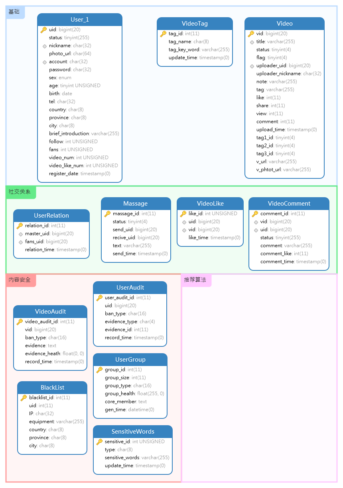

minitrill 数据库架构设计
=================
2018 TEG 信息安全部 mini项目 数据库架构设计

### 一. 全局唯一ID
*全局唯一ID的获取及使用方法*

1. 数据库预估规模

| 数据类型 | 预估规模 |
| - | :-: |
| 用户信息量 | 1,000,000|
| 短视频数量 | 100,000 |
| 用户关系数 | 5,000,000 | 
| 视频评论数 | 1,000,000 | 

2. 全局唯一ID获取方法
因为项目整体基于Python开发,所以需要选取一个使用于Python的可移植的id生成器
> 选取了 **Liunx** 环境下 **Python 2.7+**  版本内建的 hash() 方法作为id生成器

数据库共两个全局ID (均为19位整数):
* 用户全局唯一ID - uid *(根据账号hash生成)*
* 视频全局唯一ID - vid *(根据视频名hash生成)*

使用hash()方法生成极为方便,例如 生成账号为 `h-j-13` 的uid代码如下:
```python
>>> hash('h-j-13')
1254600603083085472
```
可得, 账号`h-j-13`的 uid 为 **1254600603083085472**

注意:
由于Python在Windows和Linux平台下的解释器版本不同,所以在windows下执行可能会生成完成不一样的结果. **请务必在Linux下运行全局ID相关代码**


3. 全局唯一ID使用方法
为了性能及后期扩容的需要,现在将用户表**水平拆分**为用户表群(**共10张分表**),以uid为界限进行分割,获取用户全局ID对应的分表号的代码如下:
```python
def get_table_num(hash_value):
    """根据hash值获取分表号"""
    if -9223372036854775807 <= hash_value < -7393347003251626769:
        return 1
    elif -7393347003251626769 <= hash_value < -5544820905583124692:
        return 2
    elif -5544820905583124692 <= hash_value < -3703662328893783636:
        return 3
    elif -3703662328893783636 <= hash_value < -1864090509109668823:
        return 4
    elif -1864090509109668823 <= hash_value < -25556603170130521:
        return 5
    elif -25556603170130521 <= hash_value < 1829170723854020188:
        return 6
    elif 1829170723854020188 <= hash_value < 3671409183307186906:
        return 7
    elif 3671409183307186906 <= hash_value < 5513089284982408107:
        return 8
    elif 5513089284982408107 <= hash_value < 7373459306470554807:
        return 9
    elif 7373459306470554807 <= hash_value < 9233372036854775808:
        return 10
    else:   # 越界
        raise IndexError("Unexcept hash value")
```
*注意,只用用户表进行了分表,视频表未进行分表*


### 二. 数据库架构
*数据库架构的设计思想及说明*
数据库整体架构如图所示


共分为4区:
* 后台基础区
* 社交关系区
* 内容安全区
* 推荐算法区

#### 后台基础区
1. 用户表群(这里一共十张用户表,以hash分割)

| 字段名称 | 字段类型 | 字段索引/其他 | 备注 |
| - | :-: | :-: | :-: |
| uid | bigint | PK | 用户全局唯一ID | 
| status | tinyint | NL | 用户状态(0-未审核, 1 - 正常,-1 - 封禁) | 
| nickname | char | NL | 昵称 | 
| photo_url | char | NL | 头像路径 | 
| account | char | NL | 账号 | 
| password | char | NL | 密码的hash值 | 
| sex | enum('男','女','保密') |   | 性别 | 
| age | char |   | 年龄 | 
| birth | char |   | 生日 | 
| tel | char |   | 电话 | 
| country | char |   | 国家 | 
| province | char |   | 省份 | 
| city | char |   | 城市 | 
| brief_introduction | varchar |   | 自我介绍(255字以内) | 
| follow | int | NL-默认0 | 关注数 | 
| fans | int | NL-默认0 | 粉丝数 | 
| video_num | int |  NL-默认0 | 作品数 | 
| video_like_num | int | NL-默认0 | 作品获赞数 |
| register_date | timestamp | 自动生成 | 注册时间 | 

 
*有关字段说明*:
* 关注数和粉丝数,视频数量

此字段**不一定要实时更新**,可以每一段时间根据其他表数据更新.
api直接请求本表数据速度更快(类似缓存,用空间换时间).

* 头像路径
此字段默认值为
`'/data/minitrill/user/photo/default/default.jpg'`

推荐将头像字段按照如下的形式保存

    ├─data      
    │  ├─minitrill      
    │  │  ├─user        
    │  │  │  ├─default          // 存放部分默认和可选头像       
    │  │  │  ├─1                // 存放表1用户的头像, 以此类推      
    │  │  │  ├─2        
    ...      
    │  │  │  ├─10       

2. 视频表

| 字段名称 | 字段类型 | 字段索引/其他 | 备注 |
| - | :-: | :-: | :-: |
| vid | bigint | PK | 视频全局唯一ID | 
| title | varchar | NL\UNI | 视频标题 | 
| status | tinyint | NL | 视频状态 (0-未审核, 1 - 正常,-1 - 封禁) | 
| flag | tinyint | NL | 视频处理标记 (0-未处理, 其他 后台,视频存储自行协商 | 
| uploader_uid | bigint | NL\IND | 上传者全局唯一ID | 
| uploader_nickname | char | NL | 上传者昵称 | 
| note | varchar | NL | 视频信息 | 
| tag | varchar | NL | 视频标签 (多个标签用;分割,例如 : 游戏;英雄联盟;盲僧;王者) | 
| like | int | NL-默认0 | 点赞数 | 
| comment | int | NL-默认0 | 评论数 | 
| share | int | NL-默认0 | 分享数 | 
| upload_time | timestamp | 自动生成 | 上传时间 | 
| tag1_id | tinyint |   | 标签1 id | 
| tag2_id | tinyint |   | 标签2 id | 
| tag3_id | tinyint |   | 标签3 id | 
| v_url | varchar |   | 视频索引 | 
| v_phtot_url | varchar |   | 视频缩略图索引 | 

**有关视频搜索**:

未添加视频搜索相关字段索引,因为视频搜索功能大多是是根据关键词的模糊搜索
SQL 在执行 `where v like '%s...%s'` 的时候,**不会使用索引**,
在MyISAM引擎中的全文索引虽然有类似功能但并使用场景非常有件. 故为对title字段设置任何索引

*解决思路*:
*  通过like语句用MySQL全表扫描提供服务
* 通过推荐算法模块提供搜索服务
* 通过其他搜索工具与框架同步标题id等数据,提供服务


3. 视频标签表

| 字段名称 | 字段类型 | 字段索引/其他 | 备注 |
| - | :-: | :-: | :-: |
| tag_id | int | PK | 标签id | 
| tag_name | char |  | 标签名称 | 
| tag_key_word | varchar |  | 标签关键词 (TOP10) | 
| update_time | timestamp | 自动更新 | 标签更新时间 | 

#### 社交区

1. 用户关系表

| 字段名称 | 字段类型 | 字段索引/其他 | 备注 |
| - | :-: | :-: | :-: |
| relation_id | int | PK | 关系id (自增,无需手动填写) | 
| master_uid | bigint | IND | 被关注者UID | 
| fans_uid | bigint | IND | 关注者UID | 
| relation_time | timestamp | 自动生成 | 关系创建时间 | 

> 以1m用户为数量级预估,主要关系可能在10m这个数量级,因为此表非常小且无字符型变量,
> 故直接整合为一表,剩去了分表中冗余的情况.主要是简单,(若后期性能出现问题则考虑用redis缓存大V数据)
> 此外,此表的一条记录 只表示, fans_id 主动关注了 master_id 关注关系只是单向的. 

2. 私信表

| 字段名称 | 字段类型 | 字段索引/其他 | 备注 |
| - | :-: | :-: | :-: |
| massage_id | int | PK | 关系id (自增,无需手动填写) | 
| status | tinyint | NL-默认0 | 评论状态(0-未处理,1-正常,-1-禁止) | 
| send_uid | bigint | IND | 发送者uid | 
| recive_uid | bigint | IND | 接收者uid | 
| text | varchar |  | 私信内容 | 
| send_time | timestamp | 自动生成 | 发送时间 | 

3. 视频评论表

| 字段名称 | 字段类型 | 字段索引/其他 | 备注 |
| - | :-: | :-: | :-: |
| comment_id | int | PK | 评论记录id (自增,无需处理) | 
| vid | bigint | IND | 视频全局唯一ID | 
| uid | bigint | IND | 用户全局唯一ID | 
| status | tinyint | NL-默认0 | 评论状态(0-未处理,1-正常,-1-禁止) | 
| comment | varchar | IND | 评论内容 | 
| ref_comment_id | int |  | 本评论回复的评论id | 
| comment_like | varchar |  | 评论喜欢数 | 
| comment_time | timestamp | 自动生成 | 评论时间 | 

4. 视频点赞表

| 字段名称 | 字段类型 | 字段索引/其他 | 备注 |
| - | :-: | :-: | :-: |
| like_id | int | PK | 点赞记录id (自增,无需处理) | 
| vid | bigint | IND | 视频全局唯一ID | 
| uid | bigint | IND | 用户全局唯一ID | 
| like_time | timestamp | 自动生成 | 点赞时间 | 

额外创建点赞记录表主要用于:
* 记录点赞时间
* 分析点赞用户行为 (防水,用户特征)

#### 内容安全区

1. 用户社群表
| 字段名称 | 字段类型 | 字段索引/其他 | 备注 |
| - | :-: | :-: | :-: |
| group_id | int | PK | 社群ID | 
| group_size | int |  | 社群规模 | 
| group_type | char |  | 社群类型 | 
| group_health | float |  | 社群健康度 | 
| core_member | varchar |  | 核心成员 (以;分割 uid) | 
| gen_time | timestamp | 自动生成 | 社区记录生成时间 | 


2. 用户审核表

| 字段名称 | 字段类型 | 字段索引/其他 | 备注 |
| - | :-: | :-: | :-: |
| user_audit_id | int | PK | 用户审核数据ID | 
| uid | bigint |  | 用户全局唯一ID | 
| ban_type | char |  | 封禁类型 | 
| evidence_type | tinyint |  | 证据类型ID | 
| evidence_id | int |  | 证据信息ID  | 
| record_time | timestamp | 自动生成 | 封禁时间 | 

3. 视频审核表

| 字段名称 | 字段类型 | 字段索引/其他 | 备注 |
| - | :-: | :-: | :-: |
| video_audit_id | int | PK | 视频审核id | 
| vid | bigint |  | 视频vid | 
| ban_type | char |  | 封禁类型 | 
| evidence | text |  | 封禁证据(图片base64编码) | 
| evidence_heath | float |  | 封禁证据健康度  | 
| record_time | timestamp | 自动生成 | 封禁时间 | 

4. 敏感词表

| 字段名称 | 字段类型 | 字段索引/其他 | 备注 |
| - | :-: | :-: | :-: |
| sensitive_id | int | PK | 记录ID | 
| type | char |  | 敏感词类型 | 
| sensitive_words | varchar |  | 敏感词列表 (以;分割) | 
| update_time | timestamp |  | 更新时间 | 

> 主要配合前段屏蔽使用


后续可能会不断补充相关表

#### 推荐算法区
由推荐算法组自行生成,主要为视频特征表和用户特征表


### 三. 配置调优
*基于MySQL5.7 的数据库配置调优*
考虑到服务器上其他的业务及程序需求,将InnoDB的 **缓存大小设置为20G左右**.
其他详细设置参考 `my.cnf` 配置文件


```
# my.cnf - MySQL 配置文件
# 2018 Tencent Teg 信息安全部 MINI项目 ---- minitrill 
#
# @author   :   h-j-13
# @time     :   2018-07-17

[client]
# ------------客户端配置----------------
port      = 3306
socket    = /tmp/mysql.sock

[mysqld]
# ------------主要配置-----------------
# 基础信息
port      = 3306
user      = root
socket    = /tmp/mysql.sock

# 路径设置
basedir   = /usr/local/mysql
datadir   = /data/minitrill/data/mysql-data
log-error = error.log
server-id = 1

# 字符编码
character_set_server = utf8mb4

# 表名大小写敏感
lower_case_table_names = 0

# 连接设置
max_connections = 1024  
back_log = 600  
max_connect_errors = 4000  
wait_timeout=288000
interactive_timeout = 288000
join_buffer_size = 2M  
thread_cache_size = 32 

# 引擎设置
default-storage-engine = INNODB
thread_stack = 256K
tmp_table_size = 512M  
max_heap_table_size = 256M
expire_logs_days = 7  
key_buffer_size = 2048M  
read_buffer_size = 1M  
read_rnd_buffer_size = 16M  
bulk_insert_buffer_size = 64M  
myisam_sort_buffer_size = 128M  
myisam_max_sort_file_size = 10G  
innodb_buffer_pool_size = 4G
innodb_buffer_pool_instances = 2
innodb_lock_wait_timeout = 120  
innodb_file_per_table = 0 
```

#### About

author      :   h-j-13     
time        :   2018-07-15      
last-update :   2018-07-17  